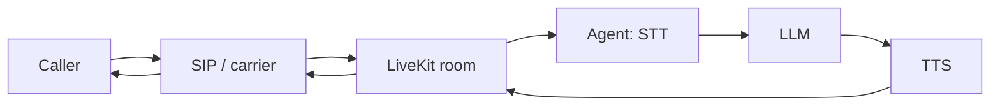

On a phone call, there is no loading spinner.

Most voice AI demos feel impressive for the first thirty seconds. Then the
delays start to stand out. You ask a question, the model pauses, the silence
stretches just long enough to feel unnatural. Callers start talking over the
agent, interruptions misfire, and the conversation loses its rhythm.

That was exactly where we were. Our initial latency averaged **1.4–2.1
seconds** from "caller stops speaking" to "agent audio begins." Technically
acceptable. Conversationally terrible.

Getting it sub-500ms wasn't one big fix. It was several weeks of tuning every
stage of the pipeline — and a series of small refusals to wait.

<BlogImage
  src="/projects/OpenMic.gif"
  alt="The OpenMic dashboard"
  caption="The agents in question — OpenMic, the voice AI platform I work on."
/>

## The stack

Calls arrive over SIP from telephony carriers (Twilio, Plivo, Jambonz) and land
in a LiveKit room. A Python agent built on **LiveKit Agents** orchestrates a
streaming STT → LLM → TTS pipeline — what LiveKit calls the cascaded pipeline
architecture — deployed on LiveKit Cloud:

The problem wasn't any single component. It was the accumulated delay across
every stage.

## The latency budget

Profiling with LiveKit Cloud's observability traces, the time was distributed
roughly like this:

| Stage                    | Initial latency |
| ------------------------ | --------------- |
| User endpoint detection  | 600–900ms       |
| STT finalization         | 250–400ms       |
| LLM first token          | 200–500ms       |
| TTS startup              | 200–350ms       |
| Playback buffering       | 100–200ms       |

The biggest surprise: **endpointing**. The model was never the primary
bottleneck — the agent simply waited too long before deciding the caller had
finished speaking. That one insight reshaped the whole optimization strategy.

<Callout type="tip" title="Profile the silence">
If you only trace your services, this delay is invisible — it lives between
the caller's last word and your first byte of processing. It was our largest
single line item, and we almost blamed the LLM for it.
</Callout>

## Turn detection: the biggest single win

Default turn-taking settings are conservative, because interrupting a human
mid-sentence feels worse than replying slowly. But for realtime conversation
you have to bias toward responsiveness. LiveKit Agents exposes fine-grained
turn handling controls, and we changed most of them:

- lowered the minimum endpointing delay
- enabled adaptive interruption handling, so aggressive endpointing doesn't
  turn into accidental cutoffs
- tuned interruption duration thresholds
- enabled noise isolation ahead of detection

This alone cut roughly **400ms** from median response time — more than any
model or provider change we made.

## Streaming everything, for real this time

Every provider we used already "supported streaming." It didn't matter: one
blocking operation anywhere destroys responsiveness. Auditing the pipeline, we
found and removed synchronous transcript waits, a non-streaming TTS fallback
path, delayed playback queues, and blocking tool execution.

The rule that emerged: the moment the LLM emits useful tokens, audio
generation starts. Callers judge responsiveness by **time to first syllable**,
not time to completed sentence.

## Preemptive generation: paying compute for milliseconds

The most debated change internally: letting the LLM start generating *before*
the caller's turn is fully confirmed, and in selected flows starting TTS
preemptively too.

<Callout type="warning" title="The trade">
Preemptive generation buys latency with wasted compute: when the caller keeps
talking, the speculative response is cancelled and discarded. Higher
cancellation rates, slightly higher inference cost. For us, the
conversational quality was worth every discarded token.
</Callout>

## Clean audio is fast audio

An unexpected finding: bad audio increases latency, not just transcription
errors. Background noise delays endpoint detection, misfires interruptions,
and destabilizes transcripts. Enabling noise cancellation before audio reaches
STT barely moved the *median*, but it noticeably tightened **tail latency** —
conversations became predictable.

## The numbers

| Metric                      | Before        | After   |
| --------------------------- | ------------- | ------- |
| Median response latency     | 1.7s          | 420ms   |
| P95 latency                 | 2.8s          | 780ms   |
| Endpointing delay           | ~700ms        | ~220ms  |
| Interruption success rate   | ~60%          | ~92%    |

The metric I care most about isn't in the table: the agent stopped feeling
like a system waiting for its turn, and started feeling like a participant.

## Why we stayed with the cascaded pipeline

We evaluated realtime speech-to-speech models and deliberately kept
STT → LLM → TTS. Production pulled us that way: reliable tool calling,
auditable transcripts, deterministic speech output, per-stage observability,
and the freedom to swap any provider independently. Speech-to-speech is
magical in a demo; the cascaded pipeline is operable at 2am.

## What actually got faster

Here's the part that stays with me. When we hit sub-500ms, I went back
through the changelog — no rewritten algorithms, no faster models. Nearly all
of the latency was *waiting*: for silence thresholds to expire, for
transcripts to finalize, for turns to be confirmed, for buffers to flush.

Most slowness — in pipelines and in projects — isn't the work being slow.
It's things sitting in queues, waiting for a "done" signal they never needed.

The fastest model in the world still feels slow if your agent waits 800ms to
decide you've stopped talking.
