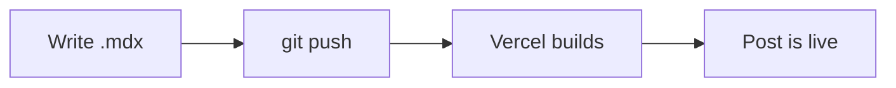

Welcome to the writing corner of the site. This first post is also the manual —
it shows everything you can drop into a post, so future-me can copy from it.

Every post is a single `.mdx` file in `content/blog/`. The stuff at the very top
(between the `---` fences) is **frontmatter** — the post's metadata:

<Callout type="tip" title="Frontmatter fields">
`title`, `date`, and `summary` are required; `tags` and `cover` (a banner image)
are optional. Every `.mdx` in `content/blog/` is published automatically — set
`draft: true` only to keep an unfinished post off the site.
</Callout>

## Writing prose

Regular Markdown just works: **bold**, _italics_, `inline code`, and
[links to anywhere](https://openmic.ai) — external links open in a new tab
automatically, internal ones like [the projects section](/#projects) use
client-side navigation.

> Blockquotes render like this — good for pulling out a key line or a quote from
> someone smarter than me.

Lists too — unordered:

- Bullets, with `marker` styling that matches the theme
- Nested items and task lists — all standard GitHub-flavored Markdown

…and ordered:

1. Write the post
2. Commit it
3. Push — it's live

## Code, with real syntax highlighting

Fenced code blocks are highlighted at **build time** with Shiki — zero
JavaScript ships to the browser for this.

### Titles and line highlights

Add a title after the language, and highlight specific lines with `{...}`:

```js title="lib/blog.js" {3-4}
export function getAllPosts() {
  return getPostSlugs()
    .map((slug) => getPostBySlug(slug).meta)
    .filter((meta) => !meta.draft)
    .sort((a, b) => (a.date < b.date ? 1 : -1));
}
```

Add `showLineNumbers` to number every line:

```python title="greet.py" showLineNumbers
def greet(name):
    return f"hello, {name}"
```

#### A note on nesting

Headings nest in the table of contents on the left — `h2` sits flush, `h3`
indents once, `h4` indents again — with the section you're reading highlighted
as you scroll.

### Inline code

Inline code such as `getStaticProps` and `output: 'export'` gets a subtle chip
treatment so it stands out in a sentence.

## Callouts

Four flavors, for when a paragraph needs to raise its voice:

<Callout type="note">A neutral note — the default.</Callout>
<Callout type="warning" title="Heads up">
Static export means no server at runtime — everything here is generated at build.
</Callout>
<Callout type="important">Use these sparingly or they stop meaning anything.</Callout>

## Images

Drop an image with standard Markdown syntax and it renders as a bordered figure:


Or use the `<BlogImage>` component directly when you want a caption:

<BlogImage
  src="/projects/CashFlow.gif"
  alt="CashFlow demo"
  caption="Fig 1. A caption appears only when you pass one."
/>

## Tables

| Feature            | How it's stored     | Rendered when |
| ------------------ | ------------------- | ------------- |
| Posts              | `.mdx` files in git | build time    |
| Syntax highlight   | Shiki (build time)  | build time    |
| Tag filtering      | client state        | runtime       |

## Diagrams

A ` ```mermaid ` block renders as a real diagram:



---

That's the whole toolbox. To publish a new post, drop a `.mdx` file in
`content/blog/`, fill in the frontmatter, and it shows up on the
[writing index](/blog) automatically — newest first.
