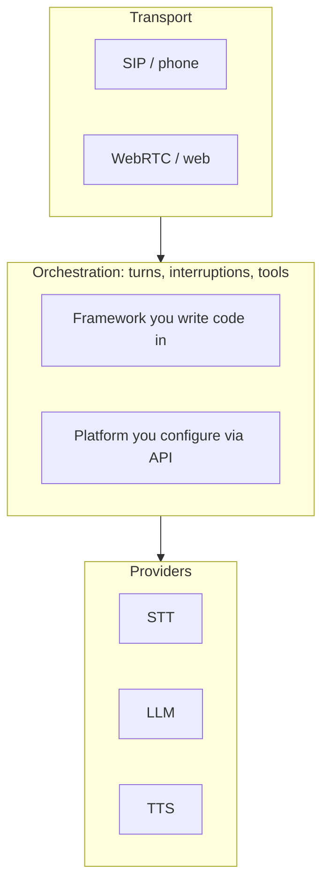

The question I get most often about voice agents is "should I use LiveKit or
Vapi?" It's the wrong first question, because those two aren't competing for
the same job. One is a framework you write an agent in. The other is a product
that runs an agent for you.

Sorting the landscape by that distinction makes the choice much easier than
sorting it by feature checklists.

## Two layers, not one list

Every voice agent — every single one — is the same loop underneath: get audio
in, decide when the human stopped talking, transcribe, think, speak, and
handle being interrupted. What differs is how much of that loop you own.

Frameworks hand you the orchestration layer as source code. Platforms hand it
to you as a config object behind an API. Almost everything else — the STT, the
LLM, the TTS, the carrier — is swappable in both cases.

## The frameworks

### LiveKit Agents

LiveKit started as an open-source WebRTC server and grew the agents framework
on top of it. That heritage shows: media transport is the part it is genuinely
excellent at, and it's the layer I'd trust with a thousand concurrent calls.

What you get: Python and Node SDKs, a real SIP stack for telephony, plugins for
essentially every provider, and a purpose-built turn-detection model that
decides whether a pause is a real end of turn or just someone thinking. That
last piece was worth more to me than any model upgrade — I
[wrote about that separately](/blog/ai-voice-latency-sub-500ms).

The cost is that you are writing and operating a service. You either run
LiveKit yourself or pay for LiveKit Cloud, and either way the agent is your
code, with your deploys and your on-call.

### Pipecat

Pipecat comes from the Daily team and takes a different design stance: a
pipeline of small processors passing frames to each other. Audio in, frames
through the pipeline, audio out — and you can insert your own processor
anywhere in that chain.

That composability is the appeal. If you want to intercept a transcript before
it reaches the LLM, or gate TTS on some business rule, it's a natural thing to
express rather than a fight. Pipecat is also transport-agnostic (its own
WebRTC, WebSockets, Twilio, Daily), and Pipecat Flows gives you structured
state machines when you want a scripted call instead of an open-ended one.

<Callout type="note" title="How I'd split them">
LiveKit if the hard part of your problem is media and scale. Pipecat if the
hard part is the conversation logic and you want to reshape the pipeline.
Both are good; neither is a choice you'll regret.
</Callout>

### The ones people forget

- **Deepgram Voice Agent API** — one WebSocket with STT, LLM and TTS behind it.
  Very little to configure, and very little to tune.
- **Twilio ConversationRelay** — Twilio handles the phone leg and the speech
  parts, you bring an LLM over a WebSocket. Sensible if you already live in
  Twilio.
- **OpenAI Realtime and Gemini Live** — speech to speech, no cascade at all.
  The most natural-sounding option and the least controllable one.
- **Vocode** — the early open-source entrant. It still exists; the momentum
  moved.

## The platforms

Vapi, Retell, Bland and ElevenLabs Agents sell the same core promise: you
describe an agent, they run it. The differences are in emphasis.

**Vapi** is the most developer-shaped of them. An assistant is a config object,
you can bring your own provider keys, and you can compose agents and tools. Of
the managed options it gives you the most knobs.

**Retell** aims squarely at phone workflows. The flow builder, batch calling
and telephony ergonomics make it quick for a support or outbound use case where
a business team, not an engineer, owns the script.

**Bland** goes the other way and owns more of the stack itself, which buys
consistency and predictable cost at the price of provider choice.

**ElevenLabs Agents** is what you'd expect from a TTS company: the voices are
the reason to pick it, and the agent layer is built around them.

<Callout type="important" title="Disclosure">
I work on OpenMic, a platform in this same category, built on LiveKit. Read my
platform-versus-framework opinions with that in mind — though most of what
follows is what building one taught me, not a pitch for it.
</Callout>

## The comparison, condensed

| Option | Layer | You own | Best when |
| ------ | ----- | ------- | --------- |
| LiveKit Agents | Framework | Agent code, deploys, scale | Media quality and scale matter |
| Pipecat | Framework | Agent code, pipeline shape | Conversation logic is the hard part |
| Deepgram / ConversationRelay | Thin API | Prompt and LLM | You want it working this afternoon |
| Realtime / Live APIs | Model | Prompt, little else | Naturalness beats control |
| Vapi | Platform | Config, tools, prompts | Devs want speed with knobs |
| Retell | Platform | Flows and scripts | Phone workflows, non-eng owners |
| Bland | Platform | Pathways | One vendor, one bill |
| ElevenLabs Agents | Platform | Config and voice | The voice is the product |

Everything in that table moves fast. Treat it as a way to think, not a spec
sheet — check the docs before you commit.

## The decision, honestly

Three questions settle it most of the time.

1. **Is the voice agent your product, or a feature of your product?** If it's a
   feature, use a platform. Building the loop yourself to run one support line
   is months you didn't need to spend.
2. **Do you need to change how turn-taking works?** If yes, you need a
   framework. Endpointing, barge-in and interruption thresholds are where voice
   agents actually feel good or bad, and a platform only exposes the dials it
   chose to expose.
3. **What does a minute cost you at scale?** Platforms charge per minute on top
   of the providers. That margin is a bargain at a thousand minutes a month and
   a real line item at a million.

The migration path is one-directional in practice: platform to framework, when
volume or control demands it. I've not seen anyone go the other way
voluntarily.

## What nobody's abstraction saves you from

Whatever you pick, the same handful of things decide whether the agent is
usable:

- **Endpointing.** How long the agent waits before it's sure you're done. Too
  high and it's sluggish; too low and it talks over people.
- **Interruptions.** Barge-in has to cancel in-flight TTS *and* the LLM turn,
  cleanly, every time.
- **Telephony audio.** Narrowband codecs, jitter and background noise degrade
  transcripts in ways your laptop mic test never showed you.
- **Observability.** Per-stage traces, or you'll be guessing which component is
  slow. It's usually not the one you think.
- **Tool latency.** A 900ms API call inside a turn is felt by the caller. Fill
  the silence, or make the call async.

None of that is a framework feature. It's the work.

## Where I landed

For OpenMic we're on LiveKit, because telephony scale and turn-detection
control were the two things we couldn't compromise on, and both are what it's
strongest at. If I were prototyping something new tomorrow and the conversation
logic were the interesting part, I'd reach for Pipecat first. And if a friend
asked me to add a voice agent to their existing SaaS, I'd tell them to use a
platform and spend the time on their product instead.

The stack matters less than people think. The last 200ms and the interruption
handling matter more than anyone expects.
