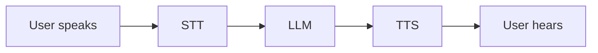

# Blog Post Authoring Guide

Paste this whole file to an LLM (or follow it yourself) to produce a post for
this site. The blog renders MDX files from `content/blog/*.mdx` at build time.

---

## Your task

Write **one complete `.mdx` file** for a blog post. Output **only** the file
contents inside a single ```mdx code block — no explanation before or after.

The blog's voice is **half engineering, half life**: technical posts (AI systems,
things I ship, what broke and why) *and* personal/reflective ones (what I'm
learning, reading, figuring out). Match whichever the topic calls for. Write in
**first person, understated, concrete**. Short paragraphs. No hype, no filler,
no emoji unless it genuinely fits.

---

## 1. Frontmatter (required, at the very top)

YAML between `---` fences:

```yaml
---
title: "Your Post Title"          # required. Plain text; keep under ~70 chars.
date: "2026-07-04"                # required. ISO YYYY-MM-DD.
summary: "One-sentence teaser."   # required. Used on cards + SEO/social. ~1 line.
tags: ["ai", "voice"]             # 1–4 lowercase tags. Use "life" for personal posts.
cover: "/blog/my-post/cover.png"  # optional banner image (see Images).
draft: false                      # optional. true = excluded from the site entirely (unfinished draft).
---
```

Rules:
- `title`, `date`, `summary` are **required**.
- Keep `summary` to a single sentence — it's the card teaser and the meta description.
- Tags are lowercase, comma-free words. Reuse existing tags where sensible
  (`ai`, `nextjs`, `architecture`, `life`, `reflections`).
- Set `draft: true` if it's not ready to publish.
- The **filename** becomes the URL slug, so name it `kebab-case.mdx`
  (e.g. `building-voice-agents.mdx` → `/blog/building-voice-agents`).

---

## 2. Structure & headings

- **Do not use `# H1`** — the title comes from frontmatter. Start sections at `##`.
- Use `##` (h2), `###` (h3), `####` (h4). These auto-populate the sticky
  "On this page" table of contents, so write real, scannable section titles.
- Open with 1–2 short paragraphs before the first `##`.

---

## 3. Components you can use

Only these two custom components exist. **Do not invent others** and **do not
write raw HTML** (`<div>`, `<span>`, `<table>`, etc.) — use Markdown instead.

### Callout — highlighted aside

```mdx
<Callout type="tip" title="Optional title">
Your text here. Keep it to a sentence or two.
</Callout>
```

- `type` (optional, default `note`): one of `note` | `tip` | `warning` | `important`.
- `title` (optional): overrides the default label.
- Put a **blank line** before and after the component.

### BlogImage — image with an optional caption

```mdx
<BlogImage
  src="/blog/my-post/diagram.png"
  alt="What the image shows"
  caption="Fig 1. Optional visible caption."
/>
```

- `src` required, `alt` recommended, `caption` optional (only shows if provided).
- Also on its own line, blank line above and below.

---

## 4. Images (important)

- **Always put an image on its own line**, with a blank line above and below.
  Never inline an image in the middle of a sentence.
- Two ways to add one — both fine:
  - Markdown: ``
  - Component: `<BlogImage src="..." alt="..." caption="..." />` (use for captions)
- **Local images:** put files in `public/blog/<slug>/` and reference them as
  `/blog/<slug>/pic.png` (leading slash, no `public`). This is the fastest, most
  reliable option — prefer it.
- **Google Drive links work:** a normal share URL
  (`https://drive.google.com/file/d/FILE_ID/view?usp=sharing`) is auto-converted
  to a direct image. The file must be shared **"Anyone with the link."** Drive is
  convenient but slower/less reliable than local files.

---

## 5. Code blocks

Fenced code is syntax-highlighted at build time (Shiki). Enhancements go on the
opening fence:

- Language: ` ```js `, ` ```python `, ` ```bash `, etc.
- Title: `title="lib/blog.js"`
- Highlight lines: `{3-4}` or `{1,5,9-12}`
- Line numbers: `showLineNumbers`

````mdx
```js title="lib/blog.js" {3-4} showLineNumbers
export function getAllPosts() {
  return getPostSlugs()
    .map((slug) => getPostBySlug(slug).meta)
    .filter((meta) => !meta.draft)
    .sort((a, b) => (a.date < b.date ? 1 : -1));
}
```
````

Inline code uses single backticks: `` `getStaticProps` ``.

### Diagrams (Mermaid)

A code block with the `mermaid` language renders as a **diagram**, not code. Use
it for flows, sequences, and architecture:

````mdx

````

Any valid Mermaid syntax works (`flowchart`, `sequenceDiagram`, `graph`, etc.).
Keep diagrams reasonably small so they read well on mobile.

---

## 6. Standard Markdown (all supported)

- **Bold**, _italic_, `inline code`
- Links: `[text](https://example.com)` — external links open in a new tab, and
  internal links like `[projects](/#projects)` navigate client-side.
- Bullet and numbered lists
- `>` blockquotes
- GFM tables:

```md
| Column A | Column B |
| -------- | -------- |
| value    | value    |
```

- `---` horizontal rule between major sections (optional)

---

## 7. Do NOT

- ❌ Use `# H1` (title is in frontmatter).
- ❌ Write raw HTML tags — use Markdown or the two components above.
- ❌ Invent components that aren't `Callout` or `BlogImage`.
- ❌ Put an image inline within a paragraph — always its own line.
- ❌ Add frontmatter fields not listed in section 1.
- ❌ Output anything except the single `.mdx` file.

---

## 8. Full example (copy this shape)

````mdx
---
title: "Building a voice agent that doesn't feel robotic"
date: "2026-07-04"
summary: "What I learned wiring realtime speech-to-text, an LLM, and TTS into something that sounds human."
tags: ["ai", "voice"]
draft: false
---

Latency is the whole game with voice. A reply that's correct but a second late
feels worse than a quick "hmm, let me check." Here's how I got the loop tight.

## The pipeline

Three stages, each streaming into the next so nothing waits for a full response.

<Callout type="tip" title="Rule of thumb">
Anything you can start before the previous stage finishes, start it.
</Callout>

### Streaming the transcript

```ts title="stt.ts" {2}
stt.on("partial", (text) => {
  llm.prime(text); // start thinking before the user stops talking
});
```

## What it looks like

<BlogImage
  src="/blog/voice-agent/latency.png"
  alt="Latency breakdown chart"
  caption="Fig 1. Where the milliseconds go."
/>

## Where I landed

| Stage | Budget  |
| ----- | ------- |
| STT   | ~150 ms |
| LLM   | ~400 ms |
| TTS   | ~200 ms |

Good enough that people stopped noticing the machine — which was the point.
````

---

## 9. After you receive the file

Save it as `content/blog/<slug>.mdx`, then commit and push — it goes live on the
next deploy. Every `.mdx` in that folder is published; set `draft: true` only if
you want to keep one off the site for now.
